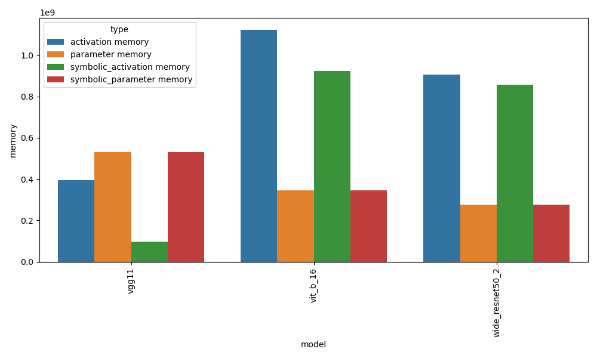
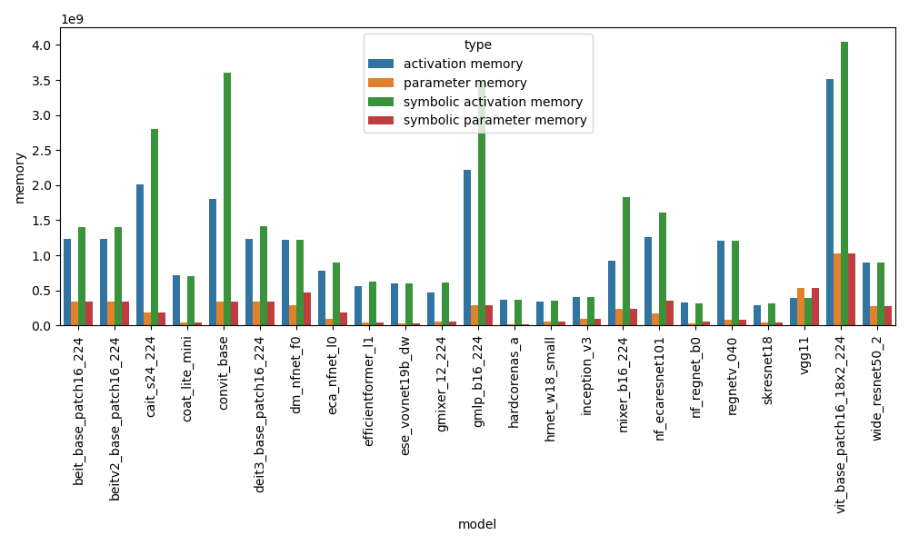

## Playground
### Benchmarking ``symbolic_profile``
```bash
python playground/profile_perf.py \
--meta_mode \ # use symbolic_profile with a meta model
--verbose \ # display results
--bias_addition_split \
--batch_size=32\
--num_steps=5\
```



